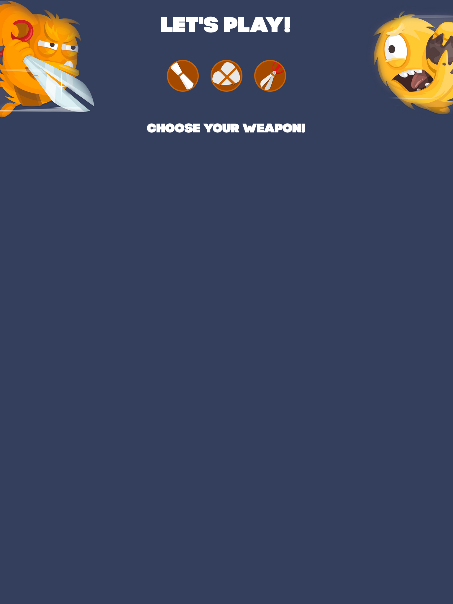
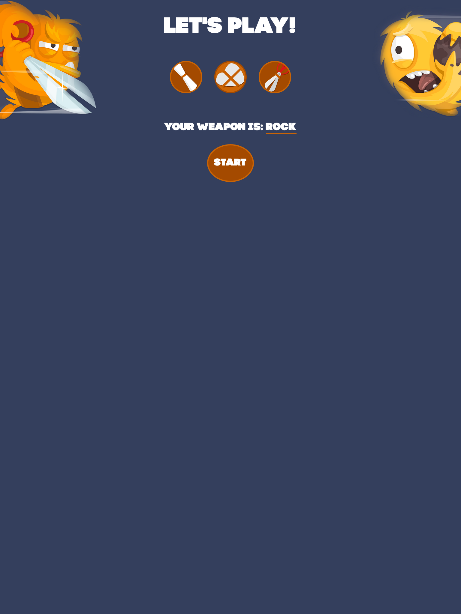
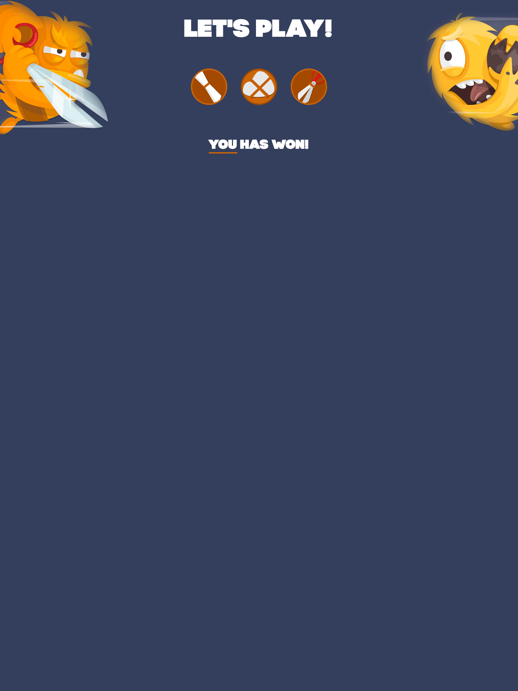
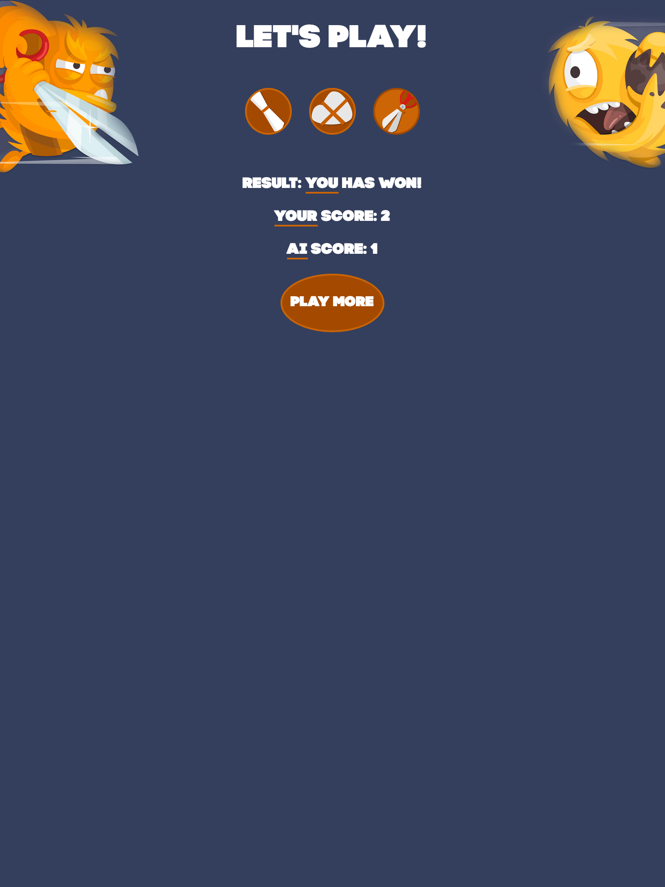

# Starting
- Use 'yarn install" to install all depencies;
- Use 'yarn serve' to run development server (localhost:8080) and watchers;
- Use 'yarn build' to build project (main.html is entry);

# Stack 
1. Yarn
2. WebPack
3. HTML5
4. CSS3
5. JavaScript (ES6)
6. ESLint

# Main Screen

# Chose Weapon

# Round

# Scores

